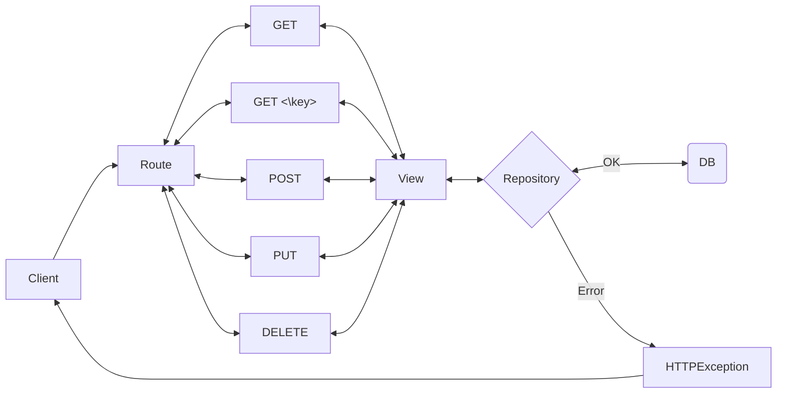

## Diagrama - Fluxo dos dados na app

```mermaid
graph LR
    A1[Client] --> A[Route]
    A <--> B[GET];
    A <--> C[GET <\key>];
    A <--> D[POST];
    A <--> E[PUT];
    A <--> F[DELETE];
    B <--> G[View]
    C <--> G[View]
    D <--> G[View]
    E <--> G[View]
    F <--> G[View]
    G[View] <--> H{Repository}
    H <--> |OK| I(DB)
    H --> |Error| J[HTTPException]
    J ----> A1
```
